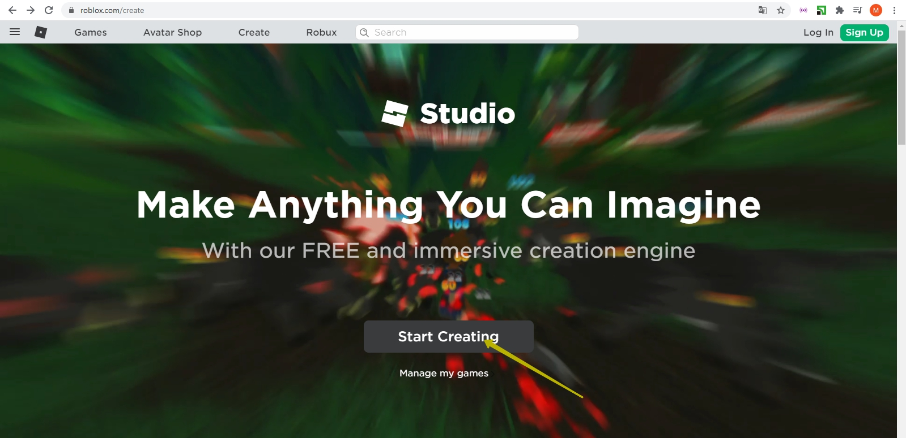
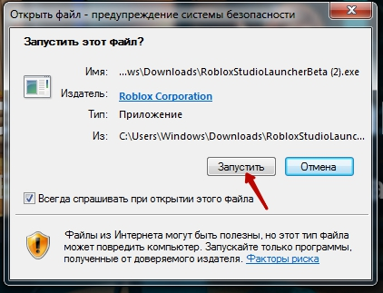

# GameDev - підготовка до пробного заняття.
## 1. Почніть працювати з Roblox Studio
Зайдіть за адресою <a href = "https://www.roblox.com/create" target = "_blank">https://www.roblox.com/create</a>  
  
Натисніть кнопку **"Start creating"**

## 2. Скачайте установщик
У вікні, що відчинеться - нажміть "Download Studio"  

## 3. Запустіть установщик
Запустіть програму, що скачалося:   

## 4. Дайте всі необхідні дозволи

## 5. Зачекайте доки Roblox Studio встановиться

## 6. Ви готові до заняття!

