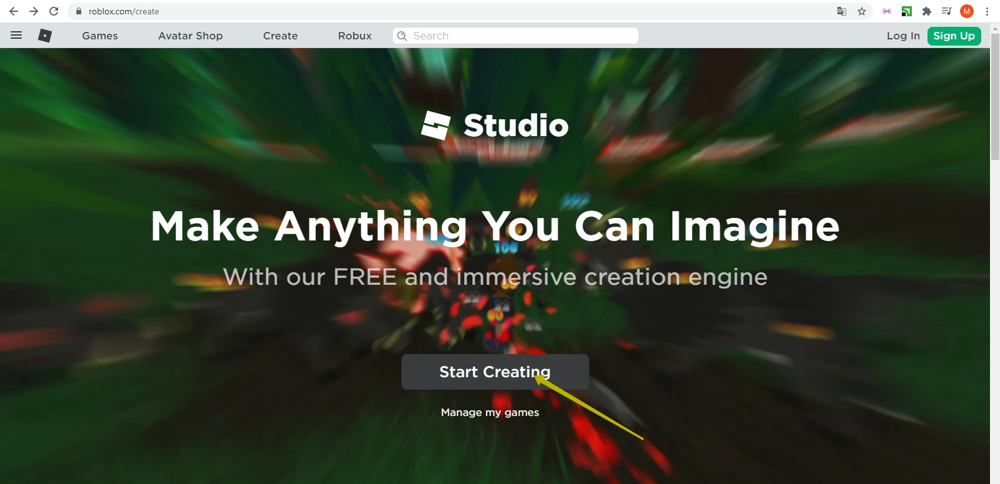
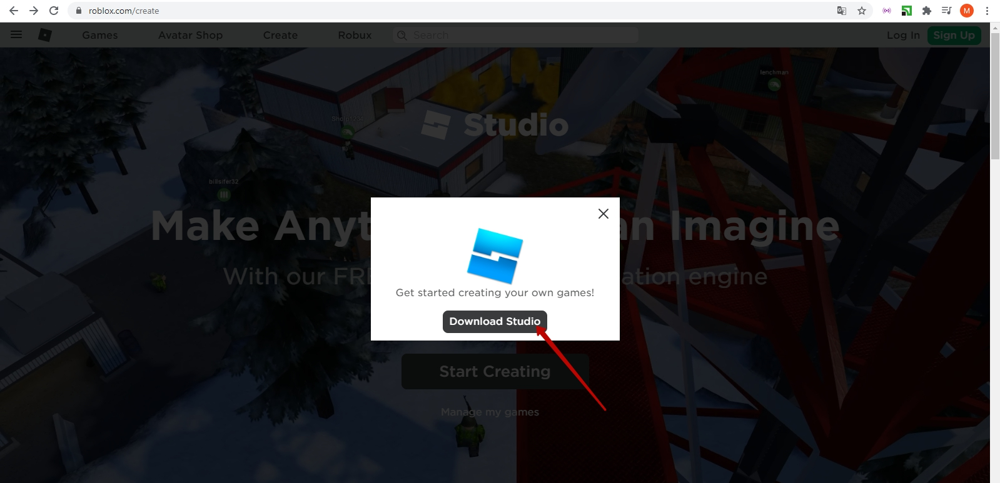
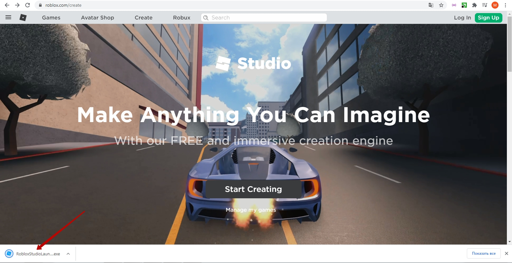
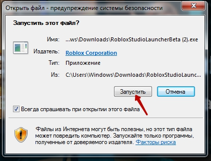
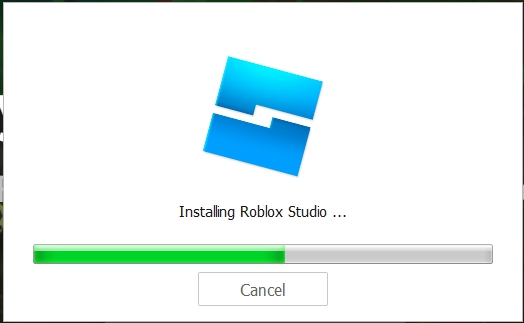
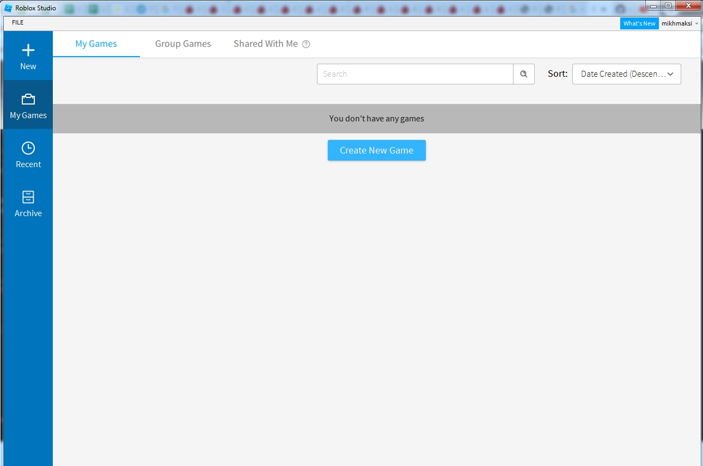

# GameDev - Preparation for the trial lesson.
## 1. Start working with Roblox Studio
Go to the address<a href = "https://www.roblox.com/create" target = "_blank">https://www.roblox.com/create</a>  
  
Press the button **"Start creating"**

## 2. Download the installer
In the window that opens, click "Download Studio".

## 3. Run the installer.
Run the downloaded program: 

## 4. Grant all necessary permissions

## 5. Wait for Roblox Studio to install.

## 6. You are ready for the lesson!

