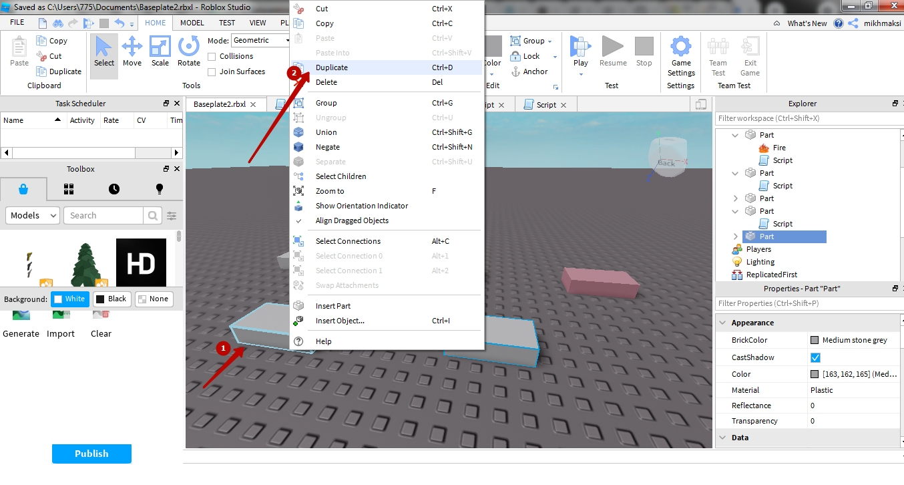

# Пробне заняття напрямок "Розробка ігор"
## При запуску RobloxStudio обиаємо шаблон "Classic Beseplate"


## Відкривається основне робоче поле


## Обираємо пункт Part і підпункт Block


## Буде створено прямокутний блок 


## В блоці меню Explorer клікнемо на плюсик 


## І оберемо пункт Script

## Нажимаємо на створений елемент Script та видалимо код print("Hello world!")


## Вставимо код та запустимо код

```lua
element = script.Parent
element.BrickColor = BrickColor.new("Dark blue")
```


## Побачемо результат



