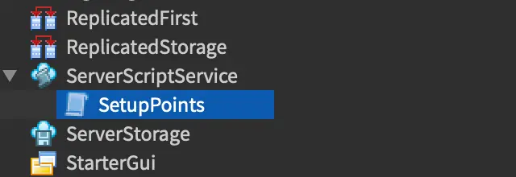

# Додавання балів.
## Вставновлення рахунку.
А розділі ServerScriptServer додаємо новий скріпт.  



До скріпту додаємо наступний код.  
```lua
local Players = game:GetService("Players")

local function onPlayerAdded(player)
  local leaderstats = Instance.new("Folder")
  leaderstats.Name = "leaderstats"
  leaderstats.Parent = player

  local points = Instance.new("IntValue")
  points.Name = "Points"
  points.Value = 0
  points.Parent = leaderstats
end

Players.PlayerAdded:Connect(onPlayerAdded)
```


## Створення блока із різними балами та вибухом


```lua
local pointPart = script.Parent

local blue = Color3.fromRGB(0, 0, 255)
local green = Color3.fromRGB(0, 255, 0)
local red = Color3.fromRGB(255 ,0, 0)

local smallPoints = 10
local largePoints = 50
local losePoints = 100

local Players = game:GetService("Players")

local function givePoints(player)
	local currentColor = pointPart.Color

	local playerStats = player:WaitForChild("leaderstats")
	local playerPoints = playerStats:WaitForChild("Points")

	if currentColor == blue then
		playerPoints.Value = playerPoints.Value + smallPoints
	elseif currentColor == green then
		playerPoints.Value = playerPoints.Value + largePoints
	else
		local playerCharacter = player.Character

		local particle = Instance.new("Explosion")
		particle.Position = pointPart.Position

		particle.Parent = playerCharacter:WaitForChild("Head")
		wait(3)
		particle:Destroy()
		playerPoints.Value = playerPoints.Value - losePoints
	end

	pointPart:Destroy()


end

local function partTouched(otherPart)
	local player = game.Players:GetPlayerFromCharacter(otherPart.Parent)

	if player then
		givePoints(player)
	end
end

pointPart.Touched:Connect(partTouched)

while true do
	pointPart.Color = blue
	wait(4)
	pointPart.Color = green
	wait(3)
	pointPart.Color = red
	wait(2)
end

```