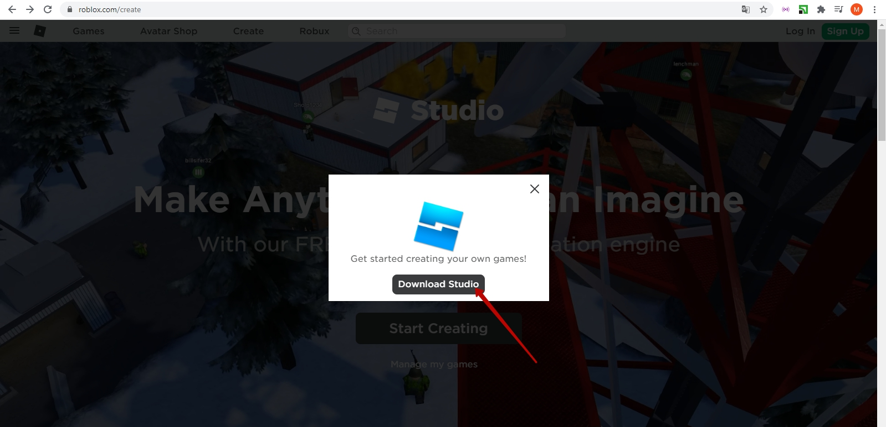
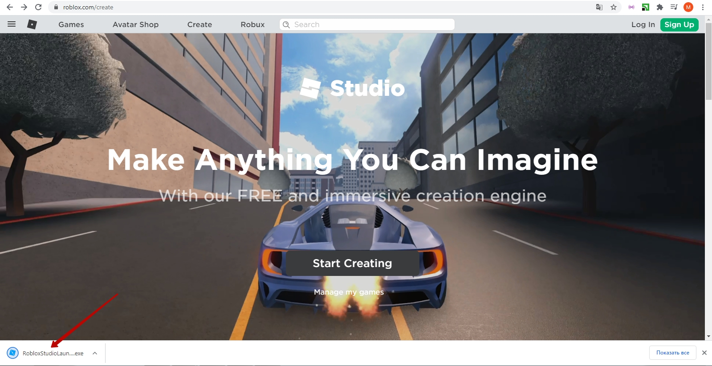
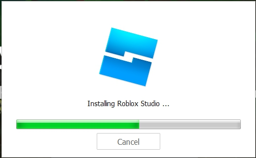
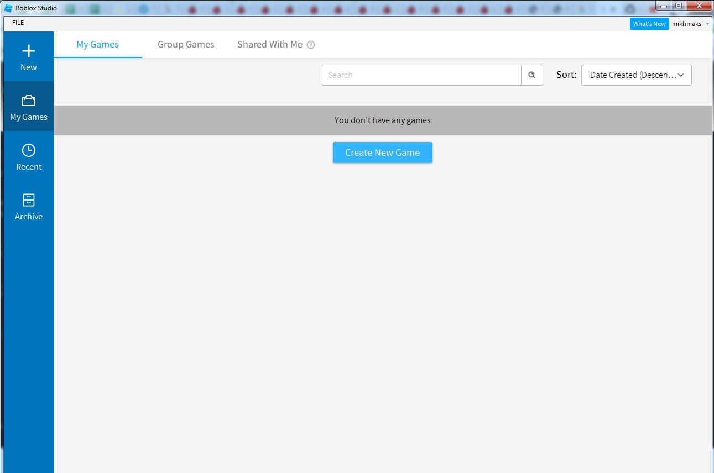

# GameDev - пробное.
## 1. Начните работать с Roblox Studio
Зайдите по адресу <a href = "https://www.roblox.com/create" target = "_blank">https://www.roblox.com/create</a>  
  
Нажмите кнопку **"Start creating"**

## 2. Скачайте установщик
В открывшемся окне нажмите "Download Studio"  

## 3. Запустите установщик
Запустите скачавшуюся программу:   

## 4. Дайте все необходимые разрешения

## 5. Подождите пока Roblox Studio установится

## 6. Вы готовы к работе

